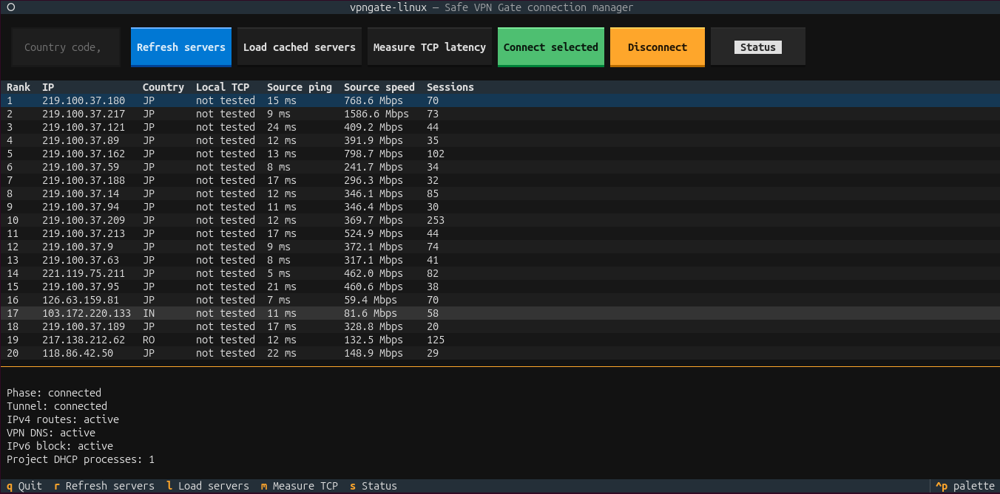

# vpngate-linux

`vpngate-linux` is a safety-focused and educational VPN Gate client for Linux.
It combines the SoftEther VPN Client with explicit Linux routing,
`systemd-resolved`, an address-only DHCP hook, rollback state, and a Textual
terminal interface.

The project is designed for learning and personal use. VPN Gate relays are
public volunteer-operated servers. They should not be treated as a trusted
privacy service or as an anonymity guarantee.

## Safety model

- Every mutating CLI operation requires an explicit `--apply` flag.
- The VPN server keeps a dedicated `/32` route through the original gateway.
- IPv4 uses owned `0.0.0.0/1` and `128.0.0.0/1` routes instead of deleting the
  original default route.
- IPv6 is fail-closed while the IPv4-only VPN is active.
- DNS uses the `~.` routing domain on `vpn_vpn` through `systemd-resolved`.
- A restricted DHCP hook applies only the address on `vpn_vpn`.
- Pending ownership state is written before network mutations.
- Disconnect and recovery remove only state that matches project ownership.
- A single process lock prevents overlapping VPN operations.
- Shell interpolation is not used for system commands.

## Requirements

- Linux with `systemd` and `systemd-resolved`
- Python 3.14 or newer
- `uv`
- `iproute2`, `isc-dhcp-client`, and `curl`
- SoftEther VPN Client
- AppArmor integration on Ubuntu systems that confine `dhclient`

Run the read-only environment check:

```console
uv run vpngate doctor
```

## Local installation

This is a source-based installer for compatible Linux desktops, not a universal
one-click package. It requires the commands listed above, a cloned project
checkout, and an existing reviewed SoftEther VPN Client directory. The
installer deliberately does not download SoftEther or install operating-system
packages.

A new user must first install the requirements, obtain a compatible SoftEther
VPN Client directory containing `vpnclient`, `vpncmd`, and `hamcore.se2`, then
clone and install the project:

```console
git clone https://github.com/aboumelon/vpngate-linux.git
cd vpngate-linux
./install.sh /absolute/path/to/vpnclient
```

The installer verifies required commands, synchronizes the locked Python
environment, installs user command and desktop launchers, installs the
SoftEther service under `/usr/local/vpnclient`, and installs the narrow
AppArmor rule when the Ubuntu `dhclient` profile is present. It requests sudo
only for the system service and AppArmor steps.

After installation, open `VPN Gate Linux` from the desktop application menu or
run:

```console
vpngate doctor
vpngate servers refresh
vpngate-gui
```

The desktop launcher opens a terminal and requests sudo authentication because
the TUI changes system routes and DNS. The launchers point to this checkout's
`.venv`, so rerun the launcher installer after moving the project directory:

```console
./scripts/install-user-launchers.sh
```

Remove only the user launchers with:

```console
./scripts/remove-user-launchers.sh
```

The individual installation steps are also available:

```console
uv sync
sudo ./scripts/install-systemd-service.sh /home/user/path/to/vpnclient
sudo ./scripts/install-dhclient-apparmor-policy.sh
```

Keep the AppArmor policy installed while a managed VPN connection is active;
`dhclient` needs it for lease renewal and release. It can be removed when the
VPN is disconnected:

```console
sudo ./scripts/remove-dhclient-apparmor-policy.sh
```

## Server workflow

Refresh from configured sources and select cached candidates:

```console
uv run vpngate servers refresh
uv run vpngate servers select --country JP --max-ping 30 --min-speed 200
```

When direct refresh is unavailable, download the official CSV through an
accessible VPN Gate mirror and import it locally:

```console
uv run vpngate servers import ~/Downloads/vpngate.csv
```

Source-reported ping and speed values are estimates. They are not measurements
from the current computer.

Measure TCP connection latency from the current computer before connecting:

```console
uv run vpngate servers probe --country JP --limit 20
```

The probe makes three TCP connections to port 443 per candidate, ranks
reachable servers by the median result, and does not establish a VPN tunnel.
It measures connection setup latency rather than download throughput.

## Prepare SoftEther once

Inspect and create the dedicated adapter and account without connecting:

```console
uv run vpngate softether inspect
uv run vpngate softether prepare 219.100.37.180 --dry-run
sudo .venv/bin/vpngate softether prepare 219.100.37.180 --apply
sudo .venv/bin/vpngate softether inventory
```

## Connect and disconnect

Always review the plan first:

```console
uv run vpngate connect 219.100.37.180 --dry-run
```

Establish the managed connection:

```console
sudo .venv/bin/vpngate connect 219.100.37.180 --apply --timeout 30
```

Inspect its recorded and observed state:

```console
sudo .venv/bin/vpngate status
sudo .venv/bin/vpngate verify
```

Disconnect and restore the original path:

```console
sudo .venv/bin/vpngate disconnect --apply
```

If a terminal, process, or connection operation was interrupted, run recovery:

```console
sudo .venv/bin/vpngate recover --apply
```

Run the complete real integration cycle with automatic final cleanup:

```console
sudo ./scripts/verify-real-connection.sh 219.100.37.180
```

## Terminal interface

The TUI can refresh and load the server cache, measure local TCP latency, and
provide Connect, Disconnect, and Status actions. Refresh is executed as the
original desktop user even though the TUI runs through sudo, preventing a
root-owned user cache. Root privileges are needed because connection actions
change networking:



```console
sudo .venv/bin/vpngate gui
```

Use `Refresh servers` to download a current list, then measure latency before
connecting. Press `q` to exit.

## Isolated diagnostic checkpoints

The lower-level commands remain available for learning and troubleshooting:

```console
uv run vpngate softether tunnel-test --dry-run
sudo .venv/bin/vpngate softether tunnel-test --apply --timeout 30
uv run vpngate network inspect 219.100.37.180
uv run vpngate network protect-server 219.100.37.180 --dry-run
uv run vpngate network lease-test 219.100.37.180 --dry-run
sudo .venv/bin/vpngate network lease-test 219.100.37.180 --apply --timeout 30
```

## Development

Run all tests without root privileges:

```console
.venv/bin/python -m unittest discover -s tests -v
```

The test suite checks parsing, route ownership, rollback, DHCP isolation,
AppArmor scope, systemd packaging, connection symmetry, the TUI data path, and
the English/Persian language policy.

On systems that permit unprivileged user namespaces, the real `iproute2`
commands can also be verified without touching the host network:

```console
unshare --user --map-root-user --net ./scripts/verify-network-namespace.sh
```

## Current limitations

- Only public IPv4 VPN Gate endpoints are supported.
- The VPN transport is SoftEther SSL-VPN through the local SoftEther client.
- Public-IP verification is best-effort because external check services may be
  unavailable; local route, DNS, and IPv6 safety checks are mandatory.
- Server availability and performance can change quickly.
- The connection state is stored under `/run`, so it is intentionally cleared
  by a reboot along with Linux runtime network state.
